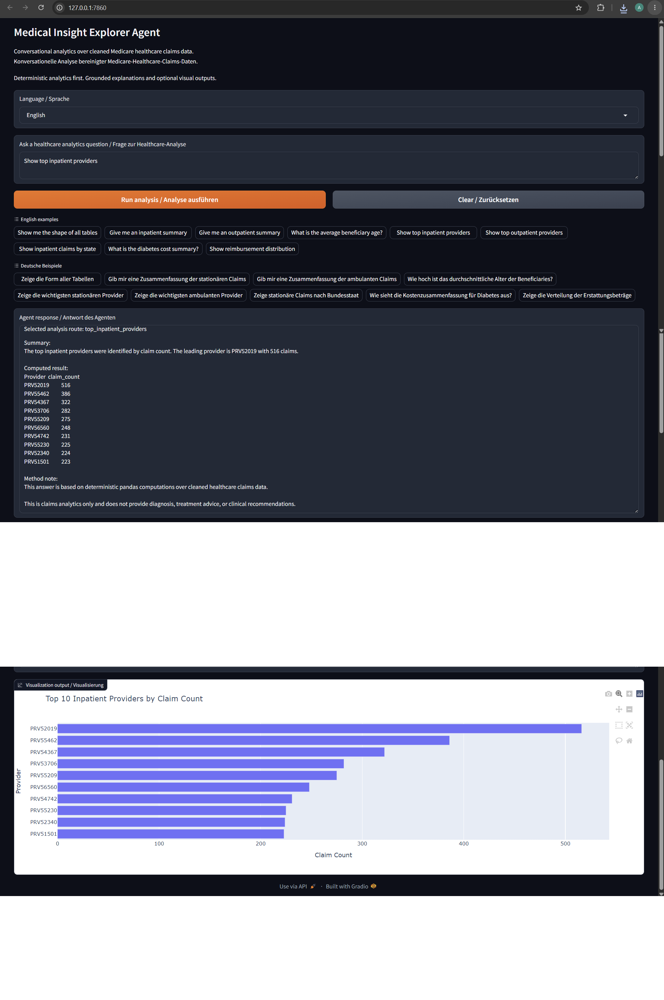
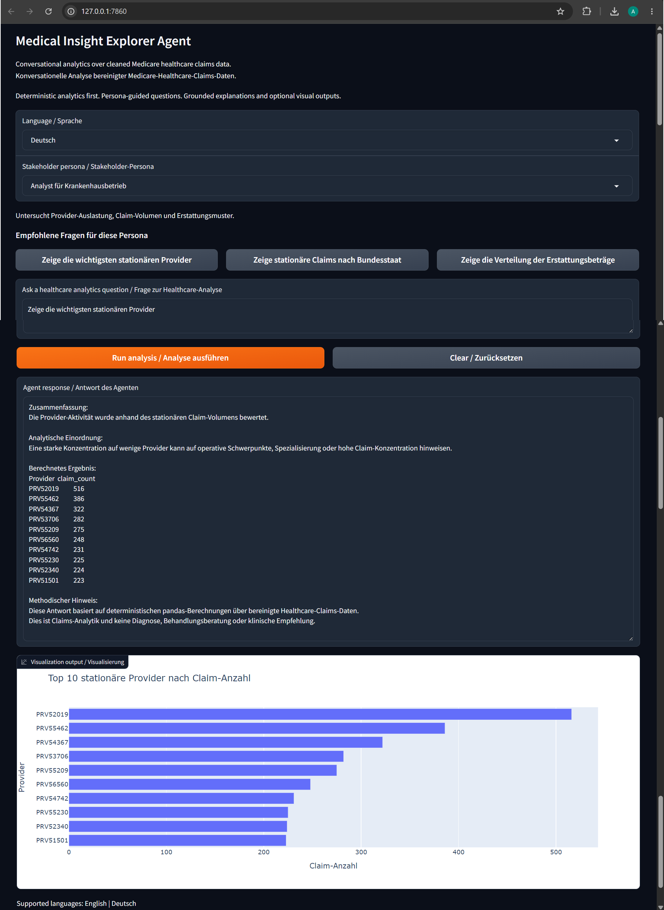

# Medical Insight Explorer Agent

Conversational AI analytics agent for exploring cleaned Medicare healthcare claims data using validated Parquet outputs from an upstream healthcare data-cleaning pipeline.

---

## Project Overview

Medical Insight Explorer Agent is a bilingual English/German conversational analytics system for cleaned Medicare healthcare claims data.

The project allows users to ask natural-language analytical questions, receive deterministic healthcare summaries, and view Plotly-based visualizations through a Gradio interface.

The main design principle is:

```text
Compute first.
Explain second.
Do not let the AI invent healthcare statistics.
```
## Business Problem

Healthcare claims datasets are often difficult to explore because they are large, relational, and spread across beneficiary, inpatient, outpatient, and provider-level tables.

This project demonstrates how an AI-assisted analytics interface can make cleaned healthcare claims data easier to explore while keeping numerical answers grounded in deterministic pandas computations.

The system is designed for:

- claims utilization analysis
- provider-level summaries
- reimbursement pattern exploration
- chronic-condition segment comparison
- bilingual analytics presentation for English and German reviewers

## Connection to Healthcare-Data-Cleaning

This repository consumes cleaned Parquet outputs produced by the companion upstream repository:

`Healthcare-Data-Cleaning`

The upstream project performs:

- raw CSV loading
- data cleaning
- validation
- feature engineering
- relationship checks
- Parquet export

This project starts from those validated Parquet files instead of repeating raw CSV cleaning.

## Architecture

```text
Raw Kaggle CSV files
        ↓
Healthcare-Data-Cleaning repository
        ↓
Cleaned validated Parquet tables
        ↓
Medical Insight Explorer Agent
        ↓
HealthcareDataLoader
        ↓
HealthcareAnalyticsEngine
        ↓
Visualization tools
        ↓
ResponseGenerator
        ↓
LangGraph workflow
        ↓
Bilingual Gradio interface
```

The system separates data loading, analytics, visualization, response generation, and user interface logic into independent modules.

## Data Inputs

Expected local input files:

```text
data/processed/train_beneficiary_clean.parquet
data/processed/test_beneficiary_clean.parquet
data/processed/train_inpatient_clean.parquet
data/processed/test_inpatient_clean.parquet
data/processed/train_outpatient_clean.parquet
data/processed/test_outpatient_clean.parquet
data/processed/train_labels_clean.parquet
data/processed/test_labels_clean.parquet
```

Full processed data files are excluded from GitHub and must be generated locally from the upstream project.

The app can also fall back to:

```text
data/sample/
```

for future lightweight demo deployment.

## Features

Current project features include:

- relational Parquet table loading
- deterministic pandas-based analytics engine
- controlled response-generation layer
- Plotly visualization tools
- English/German Gradio interface
- bilingual example prompts
- human-readable summaries
- localized method and safety notes
- placeholder visualization messaging for text-only questions
- local processed-data loading with future sample-data fallback
- LangGraph-based workflow orchestration
- Hugging Face deployment with sample-data fallback

## Example Questions

### Supported English examples:

```text
Show me the shape of all tables
Give me an inpatient summary
Give me an outpatient summary
What is the average beneficiary age?
Show top inpatient providers
Show top outpatient providers
Show inpatient claims by state
What is the diabetes cost summary?
Show reimbursement distribution
```

### Supported German examples:

```text
Zeige die Form aller Tabellen
Gib mir eine Zusammenfassung der stationären Claims
Gib mir eine Zusammenfassung der ambulanten Claims
Wie hoch ist das durchschnittliche Alter der Beneficiaries?
Zeige die wichtigsten stationären Provider
Zeige die wichtigsten ambulanten Provider
Zeige stationäre Claims nach Bundesstaat
Wie sieht die Kostenzusammenfassung für Diabetes aus?
Zeige die Verteilung der Erstattungsbeträge
```

## How It Works

The app follows a controlled analytics workflow:

```text
User question
        ↓
Language-aware question normalization
        ↓
Rule-based analytics routing
        ↓
Deterministic pandas computation
        ↓
Human-readable response formatting
        ↓
Optional Plotly visualization
        ↓
Gradio interface output
```

The response layer does not allow the LLM to freely manipulate healthcare dataframes.

All numerical results are computed first through pandas-based analytics functions.

## Local Setup

Clone the repository and install dependencies:

```bash
pip install -r requirements.txt
```

Place cleaned Parquet files into:

```text
data/processed/
```

Run the app locally:

```bash
python app.py
```

The app launches a local Gradio interface in the browser.

## Demo Screenshots

English interface:



German interface:



## Hugging Face Demo

A lightweight live demo is available on Hugging Face Spaces:

[Medical Insight Explorer Agent — Hugging Face Demo](https://huggingface.co/spaces/Artur-Melnyk/Medical-Insight-Explorer-Agent)

The deployed version uses sample Parquet files from `data/sample/` instead of the full local processed dataset.

The app preserves the same deterministic analytics workflow, bilingual English/German interface, and healthcare claims-only safety boundaries.

Deployment details are documented in:

- [Deployment Guide](docs/deployment.md)

## Documentation

- [Architecture](docs/architecture.md)
- [User Guide](docs/user_guide.md)
- [Limitations](docs/limitations.md)
- [Example Prompts](demo/example_prompts.md)
- [Data Contract](docs/data_contract.md)
- [Analytics Engine](docs/analytics_engine.md)
- [Visualization Tools](docs/visualization_tools.md)
- [LLM Response Layer](docs/llm_response_layer.md)
- [Gradio Interface](docs/gradio_interface.md)
- [LangGraph Orchestration](docs/langgraph_orchestration.md)

## Repository Structure

```text
Medical-Insight-Explorer-Agent/
├── agent/
│   ├── data_loader.py
│   ├── analytics_engine.py
│   ├── visualization_tools.py
│   ├── response_generator.py
│   ├── graph_workflow.py
│   └── prompt_templates.py
├── data/
│   ├── processed/
│   └── sample/
├── notebooks/
├── docs/
├── images/
│   └── demo/
├── demo/
├── app.py
├── requirements.txt
├── runtime.txt
└── README.md
```

## Data Governance

Raw and full processed healthcare datasets are not committed to GitHub.

The project uses local Parquet files generated from the upstream Healthcare-Data-Cleaning pipeline.

Small sample files may be added later for lightweight demo deployment.

## Limitations

This project is designed for healthcare claims analytics only.

It does not provide:

- medical diagnosis
- treatment recommendations
- clinical decision-making
- patient-level medical advice
- causal medical conclusions

The current version supports controlled analytics routes only. Unsupported questions return safe fallback responses.

## Future Improvements

Planned improvements include:

- add LangSmith tracing for workflow observability
- conditional graph routing
- richer chart routing
- unit tests
- optional database-backed analytics layer
- improve optional LLM response mode
- add richer user-facing documentation

## Status

The project currently includes:

- cleaned Parquet data loading
- deterministic analytics engine
- visualization tools
- grounded response layer
- bilingual English/German Gradio interface
- documentation and demo screenshots
- LangGraph orchestration workflow
- Hugging Face deployment support
