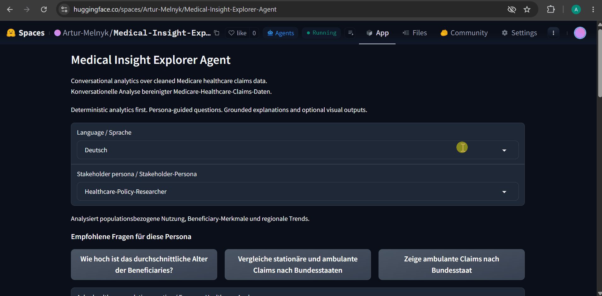

# Medical Insight Explorer Agent

[](https://huggingface.co/spaces/Artur-Melnyk/Medical-Insight-Explorer-Agent)

**v1.2.0 — Controlled Multi-Step Analytics Orchestration**

A bilingual English/German healthcare claims analytics agent combining deterministic pandas analytics, an allowlisted tool registry, bounded multi-step planning, LangGraph orchestration, Plotly visualizations, and a Gradio interface.

---

## Overview

**Medical Insight Explorer Agent** provides a conversational interface for exploring cleaned Medicare healthcare claims data.

Instead of giving an AI system unrestricted access to healthcare dataframes, the project uses a controlled analytics architecture:

```text
Natural-language question
        ↓
Language-aware normalization
        ↓
Bounded analytics planning
        ↓
Approved analytics tools
        ↓
Deterministic pandas computation
        ↓
Analytical interpretation
        ↓
Response + visualization
```

The central design principle is:

```text
Natural language may choose approved analytics.
It should not invent the analytics themselves.
```

All numerical healthcare results originate from predefined deterministic analytics functions.

The application is designed for **descriptive healthcare claims analytics**, not clinical decision-making.

---

## What's New in v1.2.0

Version **v1.2.0** extends the original single-step workflow with controlled multi-step analytical orchestration.

Key additions:

- explicit **allowlisted analytics tool registry**
- bounded **single-step and multi-step planner**
- maximum of **three approved analytics executions per plan**
- English/German compound-question normalization
- language-aware rejection of causal medical requests
- sequential LangGraph tool execution
- multi-result response synthesis
- deterministic multi-step analytical insight
- visible **Single-step / Multi-step** workflow status
- persona-guided compound analytical questions
- one primary visualization with all executed results retained in text

The release preserves the existing deterministic analytics calculations and controlled single-step behavior.

---

## Business Problem

Healthcare claims data is large, relational, and difficult to explore efficiently across beneficiary, inpatient, outpatient, provider, and reimbursement information.

Conversational analytics can make exploration easier, but unrestricted AI-generated analysis introduces risks:

- invented calculations
- inconsistent dataframe manipulation
- unsupported healthcare conclusions
- causal or clinical overinterpretation

Medical Insight Explorer Agent addresses this by separating **natural-language interaction from numerical computation**.

The planner selects from approved analytical capabilities, while deterministic pandas functions calculate the actual statistics.

---

## System Architecture

The project is downstream from the companion **Healthcare-Data-Cleaning** pipeline:

```text
Raw healthcare CSV files
        ↓
Healthcare-Data-Cleaning
        ↓
Cleaned + validated Parquet tables
        ↓
HealthcareDataLoader
        ↓
HealthcareAnalyticsEngine
        ↑
Approved Analytics Tool Registry
        ↑
Controlled Analytics Planner
        ↑
Language-aware normalization
        ↑
User question / Gradio interface

HealthcareAnalyticsEngine
        ↓
Deterministic analytical results
        ↓
Response + Insight + Chart layers
        ↓
Bilingual Gradio output
        ↓
Local application / Hugging Face Spaces
```

This creates a clear separation between:

```text
DATA ENGINEERING
        ↓
DETERMINISTIC ANALYTICS
        ↓
CONTROLLED ORCHESTRATION
        ↓
PRESENTATION
```

Detailed architecture:

- [System Architecture](docs/architecture.md)
- [LangGraph Orchestration](docs/langgraph_orchestration.md)

---

## Controlled Analytics

### Approved Tool Registry

Controller-facing analytics are defined through an explicit allowlist in:

```text
agent/tool_registry.py
```

The registry currently exposes ten approved analytical capabilities:

| Tool | Analysis |
|---|---|
| `table_shapes` | Loaded table dimensions |
| `inpatient_summary` | Inpatient claim summary |
| `outpatient_summary` | Outpatient claim summary |
| `age_summary` | Beneficiary age summary |
| `top_inpatient_providers` | Top inpatient providers |
| `top_outpatient_providers` | Top outpatient providers |
| `inpatient_claims_by_state` | Inpatient claims by state |
| `outpatient_claims_by_state` | Outpatient claims by state |
| `diabetes_cost_summary` | Reimbursement by diabetes status |
| `reimbursement_distribution` | Inpatient reimbursement distribution |

The planner cannot select arbitrary analytics-engine methods, dataframe operations, Python, SQL, or pandas expressions.

---

## Bounded Multi-Step Analytics

Simple questions use one approved tool whenever one tool is sufficient.

```text
Show top inpatient providers
        ↓
top_inpatient_providers
```

Supported compound questions can produce multi-tool plans.

For example:

```text
Compare inpatient and outpatient provider activity
        ↓
top_inpatient_providers
        +
top_outpatient_providers
```

The current release supports three compound workflows:

| Question | Approved tools |
|---|---|
| Compare inpatient and outpatient provider activity | `top_inpatient_providers` + `top_outpatient_providers` |
| Compare inpatient and outpatient claims by state | `inpatient_claims_by_state` + `outpatient_claims_by_state` |
| Compare inpatient and outpatient claim summaries | `inpatient_summary` + `outpatient_summary` |

Equivalent supported German questions normalize into the same language-independent analytical plans.

Execution is bounded by:

```text
MAX_ANALYTICS_STEPS = 3
```

There is no open-ended autonomous analytics loop.

---

## Multi-Result Responses

For supported compound questions, LangGraph executes the approved tools sequentially and retains every deterministic result.

The response can combine:

```text
Summary
Analytical workflow
Analytical steps
Analytical insight
Computed results
Method note
Safety note
```

The interface also exposes execution status such as:

```text
Single-step · 1 approved tool executed
```

or:

```text
Multi-step · 2 approved tools executed
```

Only analytical operations that were actually executed are displayed.

---

## English + German

The application supports bilingual analytical interaction while keeping the analytics engine language-independent.

```text
English ──┐
          │
German ───┤
          ↓
   normalization
          ↓
      planner
          ↓
 approved tools
          ↓
 deterministic
    analytics
          ↓
localized response
```

The normalization layer also preserves safety-relevant causal wording before planning.

Causal requests are rejected rather than converted into descriptive analytics.

---

## Stakeholder Personas

The interface provides three stakeholder perspectives:

- **Hospital Operations Analyst**
- **Healthcare Fraud Investigator**
- **Healthcare Policy Researcher**

Personas provide descriptions, recommended questions, and clickable English/German prompts.

They guide exploration but do **not** change:

- analytical formulas
- registry permissions
- planner execution limits
- healthcare safety boundaries

---

## Example Questions

### English

```text
Show top inpatient providers

Show outpatient claims by state

What is the diabetes cost summary?

Show reimbursement distribution

Compare inpatient and outpatient provider activity

Compare inpatient and outpatient claims by state

Compare inpatient and outpatient claim summaries
```

### German

```text
Zeige die wichtigsten stationären Provider

Zeige ambulante Claims nach Bundesstaat

Wie sieht die Kostenzusammenfassung für Diabetes aus?

Zeige die Verteilung der Erstattungsbeträge

Vergleiche stationäre und ambulante Provider

Vergleiche stationäre und ambulante Claims nach Bundesstaaten

Vergleiche die Zusammenfassungen der stationären und ambulanten Claims
```

More examples are available in:

[demo/example_prompts.md](demo/example_prompts.md)

---

## Visualization

Plotly visualizations are generated through controlled route-based chart logic.

Visual analyses include:

- provider rankings
- claims by state
- diabetes reimbursement comparison
- inpatient reimbursement distribution

Multi-step workflows currently render **one primary visualization**, while the textual response includes **all executed analytical results**.

This preserves the existing visualization architecture without introducing a separate multi-chart dashboard.

See [Visualization Tools](docs/visualization_tools.md) for implementation details.

---

## Live Demo

A lightweight version is deployed on Hugging Face Spaces:

**[Medical Insight Explorer Agent — Live Demo](https://huggingface.co/spaces/Artur-Melnyk/Medical-Insight-Explorer-Agent)**

The public deployment uses lightweight sample Parquet data while preserving the same core analytical and orchestration architecture.

Deployment details are available in the [Deployment Guide](docs/deployment.md).

---

## Demo

A walkthrough of the application is available here:



Additional project assets are organized as:

```text
images/demo/          application and analytics screenshots
images/architecture/  architecture diagrams
demo/                 walkthrough and example prompts
```

---

## Data

The project consumes cleaned Parquet outputs produced by the upstream **Healthcare-Data-Cleaning** project.

Full local datasets are expected under:

```text
data/processed/
```

The public deployment uses:

```text
data/sample/
```

Full processed healthcare datasets are excluded from GitHub.

See [Data Contract](docs/data_contract.md) for details.

---

## Local Setup

Clone the repository:

```bash
git clone https://github.com/ArturMelnyk-analyst/Medical-Insight-Explorer-Agent.git
cd Medical-Insight-Explorer-Agent
```

Install dependencies:

```bash
pip install -r requirements.txt
```

Run the application:

```bash
python app.py
```

The Gradio interface will provide a local address, typically:

```text
http://127.0.0.1:7860
```

If full processed data is unavailable, the application can use the configured sample-data fallback.

For detailed instructions, see the [User Guide](docs/user_guide.md).

---

## Safety and Scope

Medical Insight Explorer Agent is a **descriptive healthcare claims analytics system**.

It does not provide:

- medical diagnosis
- treatment recommendations
- patient-specific clinical advice
- clinical decision-making
- fraud determination
- causal medical conclusions

The orchestration layer does not permit unrestricted:

```text
Python
SQL
pandas
dataframe operations
analytics-engine method selection
tool execution
```

Unsupported and causal requests are handled through controlled fallback behavior.

See [Limitations](docs/limitations.md) for the complete scope and known limitations.

---

## Technical Documentation

| Document | Purpose |
|---|---|
| [Architecture](docs/architecture.md) | Overall system architecture and component boundaries |
| [LangGraph Orchestration](docs/langgraph_orchestration.md) | Planner, graph state, bounded execution, and multi-result orchestration |
| [Analytics Engine](docs/analytics_engine.md) | Deterministic healthcare analytics |
| [LLM Response Layer](docs/llm_response_layer.md) | Controlled response and optional LLM explanation architecture |
| [Visualization Tools](docs/visualization_tools.md) | Plotly visualization implementation |
| [Gradio Interface](docs/gradio_interface.md) | User-interface architecture |
| [Data Contract](docs/data_contract.md) | Input datasets and data expectations |
| [User Guide](docs/user_guide.md) | Application usage |
| [Limitations](docs/limitations.md) | Scope and known limitations |
| [Deployment Guide](docs/deployment.md) | Local and Hugging Face deployment |
| [Refactor Notes](docs/refactor_notes.md) | Earlier architectural refactoring notes |

---

## Repository Structure

```text
Medical-Insight-Explorer-Agent/
│
├── agent/
│   ├── analytics_engine.py
│   ├── chart_router.py
│   ├── data_loader.py
│   ├── graph_workflow.py
│   ├── insight_layer.py
│   ├── language_utils.py
│   ├── personas.py
│   ├── planner.py
│   ├── prompt_templates.py
│   ├── response_formatter.py
│   ├── response_generator.py
│   ├── tool_registry.py
│   └── visualization_tools.py
│
├── data/
│   ├── processed/
│   └── sample/
│
├── demo/
│   ├── demo_walkthrough.gif
│   └── example_prompts.md
│
├── docs/
│   ├── architecture.md
│   ├── langgraph_orchestration.md
│   ├── analytics_engine.md
│   ├── visualization_tools.md
│   ├── gradio_interface.md
│   ├── llm_response_layer.md
│   ├── data_contract.md
│   ├── user_guide.md
│   ├── limitations.md
│   ├── deployment.md
│   └── ...
│
├── images/
│   ├── architecture/
│   └── demo/
│
├── notebooks/
├── scripts/
├── app.py
├── requirements.txt
├── runtime.txt
└── README.md
```

---

## Portfolio Materials

Additional recruiter-facing materials include:

- [Presentation PDF](docs/Medical_Insight_Explorer_Presentation.pdf)
- [Presentation PowerPoint](docs/Medical_Insight_Explorer_Presentation.pptx)
- [Demo Walkthrough](demo/demo_walkthrough.gif)
- [Example Prompts](demo/example_prompts.md)

Together with the live Hugging Face deployment, these provide both technical and user-facing views of the project.

---

## Limitations

The current release is intentionally bounded:

- compound-question support is explicitly defined rather than open-ended
- plans are limited to three approved analytics tools
- multi-step workflows render one primary chart
- analytics are descriptive rather than causal
- the public deployment uses lightweight sample data
- optional LLM explanation capability is architecturally separate from deterministic computation

See [Limitations](docs/limitations.md) for the detailed discussion.

---

## Documentation and Release

**v1.2.0 — Controlled Multi-Step Analytics Orchestration**

The release combines:

```text
deterministic healthcare analytics
+
allowlisted analytical capabilities
+
bounded multi-step planning
+
LangGraph orchestration
+
bilingual interaction
+
controlled analytical interpretation
+
transparent workflow presentation
```

Detailed implementation and design decisions are intentionally kept in the technical documentation rather than duplicated in this README.

---

## License

See [LICENSE](LICENSE) for repository licensing information.